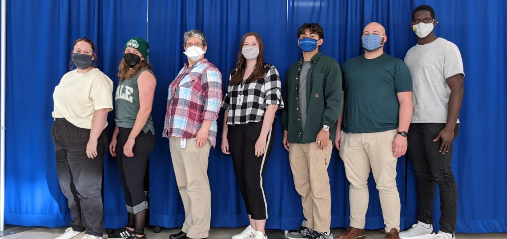

# "Metabolic capabilities are highly conserved among human nasal-associated *Corynebacterium* species" Supplemental Methods

## This repository includes:

-   Link to bioRxiv: <https://www.biorxiv.org/content/10.1101/2023.06.05.543719v1.full>

-   The raw `.fasta` files for initial input, provided [[here]{.underline}](https://github.com/KLemonLab/CorPGA_Pangenomics/tree/main/Strain_genomes).

-   Supplemental methods for program [[installations]{.underline}](SupplementalMethods_Installations.html).

-   Supplemental methods for [[Prokka v1.14.6 annotation]{.underline}](SupplementalMethods_Prokka_Annotations.html) of 107 *Corynebacterium* strain genomes.

-   Supplemental methods of pangenome analyses performed with [[GET_HOMOLOGUES, GET_PHYLOMARKERS and IQ-TREE2]{.underline}](SupplementalMethods_GET_HOMOLOGUES.html).

-   Supplemental methods for the [[anvi'o v7 pangenomic and metabolic analysis]{.underline}](SupplementalMethods_Anvio.html).

-   Supplemental methods of COG anvi'o annotated gene clusters assignments to the persistent or accessory genome with [[PPanGGOLiN analysis]{.underline}](SupplementalMethods_PPanGGOLiN.html).

-   Supplemental methods for COG functional analysis based on PPanGGOLiN partitions:

    -   [*Corynebacterium propinquum*](SupplementalMethods_COGS_Cpr.html)

    -   [*Corynebacterium pseudodiphtheriticum*](SupplementalMethods_COGS_Cps.html)
    
    -   [*Corynebacterium accolens*](SupplementalMethods_COGS_Cac.html)
    
    -   [*Corynebacterium tuberculostearicum*](SupplementalMethods_COGS_Ctu.html)

-   Supplemental methods for the [[Glycogen analysis]{.underline}](SupplementalMethods_Glycogen.html).

